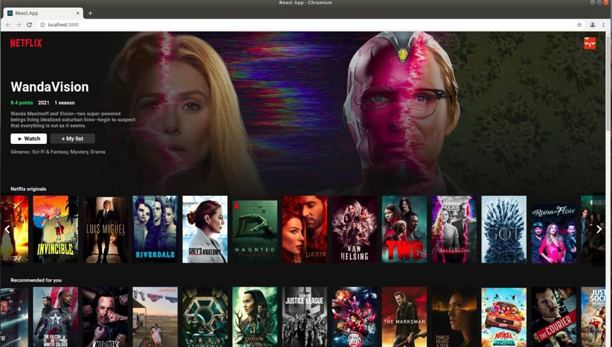
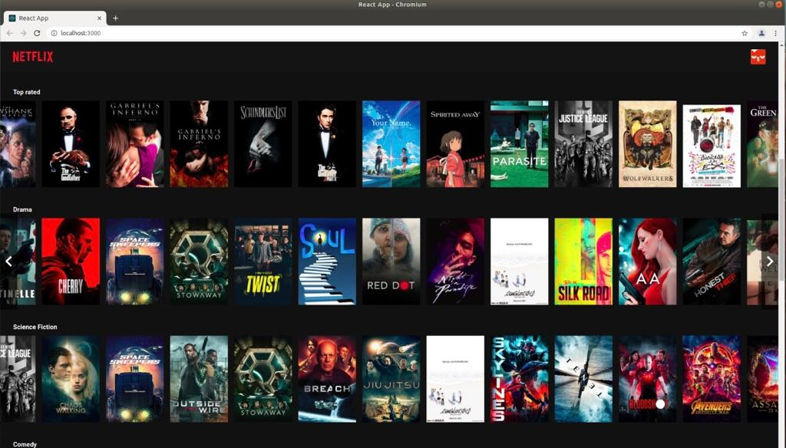
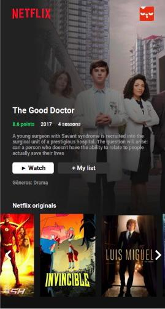
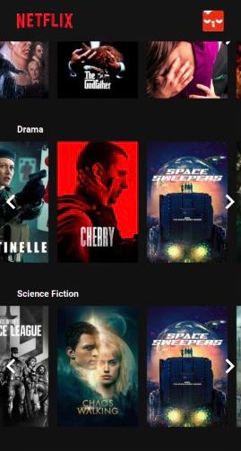

# Netflix Website Project 🍿

This is officially my first react project, a simple front-end design based on Netflix official website. My inspiration was this video https://www.youtube.com/watch?v=tBweoUiMsDg from another developer. This was an interesting project to make because I was abble to learn by practicing about the basics of React Library, JSX syntax and how to integrate an API to an APP. I hope that in the future I can create by myself more fancy Apps, but let's stick to the basis right now, right?

The API used to fill the catalog of movies and tv shows is https://www.themoviedb.org/ , an amazing free API you can use in your movie application.

The first version of this project is basic and the ideia is to release new versions in the future to add some cool features.

## **This is how it looks like on desktop 🖥️**

## **And this how it looks like on a mobile browser 🤳**

## Running the application 👩‍💻👨‍💻

### **If you don't know how to run a ReactJS project, follow this short tutorial bellow:**

 - Make shure you have nodejs and npm installed on your computer, and if you don't have, there are many youtube tutorials you can follow to install them correctly.

 - Clone this repository:  
    **$ git clone https://github.com/AnaCrisOliver/learning-react.git**

 - Go to the project folder:  
    **$ cd learning-react/first-project**

 - Install npm dependencies:  
    **$ npm install**
 
 - Run the app:  
    **$ npm start**

Then, the server will open a tab on a browser using port 3000 (probably).
Enjoy! 🍿
